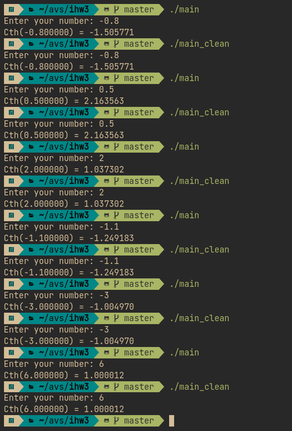

# АВС-ИДЗ3. Крупнов Иван, БПИ217, вариант 14

**Индивидуальное домашнее задание №3 по курсу Архитектуры вычислительных систем. Домашнее задание выполнено на предполагаемую оценку null.**

## Задание
> Разработать программу, вычисляющую с помощью степенного ряда с точностью не хуже 0,1% значение функции гиперболического котангенса $\coth(x) = \frac{e^x+e^{-x}}{e^x−e^{−x}}$ для заданного параметра x.


## Структура проекта
* [asm](https://github.com/shar3nda/avs-ihw3/tree/main/asm) — код на ассемблере без флагов оптимизации, в котором **прокомментированы переменные** и операции над ними
* [asm_opt](https://github.com/shar3nda/avs-ihw3/tree/main/asm) — оптимизированный с помощью флагов компиляции код на ассемблере
* [asm_reg](https://github.com/shar3nda/avs-ihw3/tree/main/asm) — код на ассемблере без флагов оптимизации, в котором **прокомментированы переменные** и использованы регистры вместо некоторых локальных переменных.
* [scripts](https://github.com/shar3nda/avs-ihw3/tree/main/scripts) — скрипты для тестирования
    * [generate_tests.py](https://github.com/shar3nda/avs-ihw3/blob/main/scripts/generate_tests.py) — утилита для генерации тестов на Python
    * [run_tests.sh](https://github.com/shar3nda/avs-ihw3/blob/main/scripts/run_tests.sh) — bash-скрипт для прогона тестов. Использование: `run_tests.sh ./<executable_name>`
    * [compile.sh](https://github.com/shar3nda/avs-ihw3/blob/main/scripts/compile.sh) — bash-скрипт для компиляции без оптимизаций
    * [compile_opt.sh](https://github.com/shar3nda/avs-ihw3/blob/main/scripts/compile_opt.sh) — bash-скрипт для компиляции с оптимизацией консольными флагами
* [tests](https://github.com/shar3nda/avs-ihw3/tree/main/tests) — автоматически сгенерированные тесты для программы
    * В файле tests/{i}.in находятся входные данные для i-го теста, а в tests/{i}.out - корректные выходные данные. Непройденные тесты автоматически выводятся скриптом [run_tests.sh](https://github.com/shar3nda/avs-ihw3/blob/main/scripts/run_tests.sh) с помощью diff.
* [main](https://github.com/shar3nda/avs-ihw3/blob/main/main) — исполняемый файл программы
* [main_opt](https://github.com/shar3nda/avs-ihw3/blob/main/main_opt) — исполняемый файл программы, скомпилированный с оптимизациями
* [main_reg](https://github.com/shar3nda/avs-ihw3/blob/main/main_reg) — исполняемый файл программы, переписанный на регистры
* [tests.log](https://github.com/shar3nda/avs-ihw3/blob/main/tests.log) — логи тестирования неоптимизированного бинарника
* [tests_opt.log](https://github.com/shar3nda/avs-ihw3/blob/main/tests_opt.log) — логи тестирования оптимизированного бинарника
* [tests_reg.log](https://github.com/shar3nda/avs-ihw3/blob/main/tests_reg.log) — логи тестирования бинарника с регистрами
* [main.c](https://github.com/shar3nda/avs-ihw3/blob/main/main.c), [parseOptions.c](https://github.com/shar3nda/avs-ihw3/blob/main/parseOptions.c), [printHelp.c](https://github.com/shar3nda/avs-ihw3/blob/main/printHelp.c), [countLU.c](https://github.com/shar3nda/avs-ihw3/blob/main/countLU.c), [options.h](https://github.com/shar3nda/avs-ihw3/blob/main/options.h) — исходные файлы на языке C

# Задания на 4 балла

## Использование программы
Программа поддерживает файловый и консольный ввод.

Ключи командной строки:
```shell
-i <input_file> - путь к входному файлу с данными
-o <output_file> - путь к файлу для вывода
-h - справка
```
Если не указан путь к файлу, программа будет принимать ввод с консоли до `EOF` и выведет информацию о тексте в `stdout`.

## Результаты тестирования
Логи тестирования находятся в файлах [tests.log](https://github.com/shar3nda/avs-ihw3/blob/main/tests.log), [tests_opt.log](https://github.com/shar3nda/avs-ihw3/blob/main/tests_opt.log) и [tests_reg.log](https://github.com/shar3nda/avs-ihw3/blob/main/tests_reg.log). Чтобы самостоятельно провести тестирование, необходимо выполнить `./scripts/run_tests.sh ./main`,`./scripts/run_tests.sh ./main_opt`, `./scripts/run_tests.sh ./main_reg`.
Тесты генерируются как последовательности ASCII-символов длиной от 500 до 5000 знаков.

## Опции компиляции
Ассемблирование без оптимизаций:
```sh
gcc -masm=intel ./file.c -S -o ./asm/file.s
```
Ассемблирование с оптимизациями:
```sh
gcc -masm=intel \
    -fno-asynchronous-unwind-tables \
    -fno-jump-tables \
    -fno-stock-protector \
    -fno-exception \
    ./file.c \
    -S -o ./asm_opt/file_opt.s 
```
После ассемблирования файлов по отдельности программа компилируется в исполняемый файл:
```sh
gcc asm/* -o main && scripts/run_tests.sh main > tests.log
```
С оптимизациями:
```sh
gcc asm_opt/* -o main_opt && scripts/run_tests.sh main_opt > tests_opt.log
```
С регистрами:
```sh
gcc asm_reg/* -o main_reg && scripts/run_tests.sh main_reg > tests_reg.log
```

## Оптимизация ассемблированных программ
Программы оптимизированы с помощью ключей командной строки, описанных выше.

# Задания на 5 баллов

## Функции с параметрами
В отдельных файлах реализованы следующие модули:
* [parseOptions.c](https://github.com/shar3nda/avs-ihw3/blob/main/parseOptions.c) - парсинг опций командной строки и формирование структуры опций программы
* [printHelp.c](https://github.com/shar3nda/avs-ihw3/blob/main/printHelp.c) - печать справки
* [countLU.c](https://github.com/shar3nda/avs-ihw3/blob/main/countLU.c) - подсчет маленьких и больших букв в буфере
* [options.h](https://github.com/shar3nda/avs-ihw3/blob/main/options.h) — описание структуры опций

## Локальные переменные
В функциях используются локальные переменные.

## Передача параметров и возвращаемые значения
В [asm](https://github.com/shar3nda/avs-ihw3/tree/main/asm) комментариями отмечены передаваемые и возвращаемые значения в функциях.

## Связь между стеком и параметрами C
В [asm](https://github.com/shar3nda/avs-ihw3/tree/main/asm) аналогично отмечено назначение регистров.

Функции принимают аргументы 1-6 в регистры `rdi`, `rsi`, `rdx`, `rcx`, `r8` и `r9`, остальные в обратном порядке добавляются на стек.

Регистры `rbx`, `rsp`, `rbp`, `r12`, `r13`, `r14`, и `r15` после выполнения функции сохраняют записанное значение, а `rax`, `rdi`, `rsi`, `rdx`, `rcx`, `r8`, `r9`, `r10` и `r11` затираются.

# Задания на 6 баллов

## Рефакторинг и комментарии к регистрам
Локальные переменные в [countLU.c](https://github.com/shar3nda/avs-ihw3/blob/main/countLU.c) убраны со стека и помещены в незатираемые регистры:
* `r12 = data`
* `r13d = length`
* `r14 = lower`
* `r15 = upper`
* `ebx = i`

Комментарии к регистрам описаны.

## Тестовые прогоны
Тесты произведены без ошибок, как и в предыдущих случаях.

## Сопоставление размеров

Переписанная на регистры программа обладает меньшим размером.

# Задания на 7 баллов

## Разделение программы
Программа разделена на несколько единиц компиляции.
## Ввод/вывод из файла
Поддерживается ввод и вывод данных из файла. Аргументы задаются в командной строке и проверяются на корректность.
## Тесты в файлах
Файлы с автоматически сгенерированными тестами находятся в директории [tests](https://github.com/shar3nda/avs-ihw3/tree/main/tests).