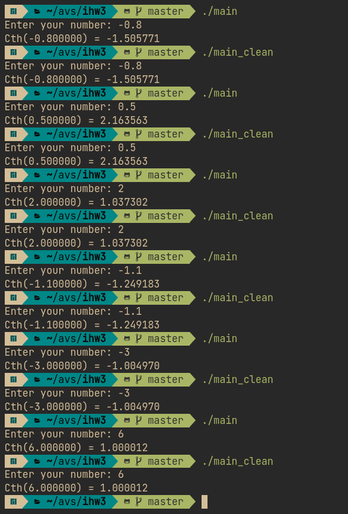
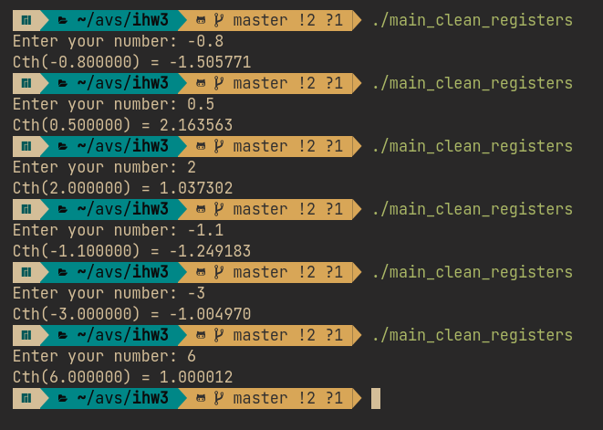
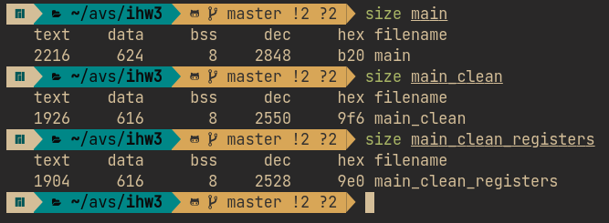

# АВС-ИДЗ3. Крупнов Иван, БПИ217, вариант 14

**Индивидуальное домашнее задание №3 по курсу Архитектуры вычислительных систем. Домашнее задание выполнено на предполагаемую оценку 6.**

## Задание
> Разработать программу, вычисляющую с помощью степенного ряда с точностью не хуже 0,1% значение функции гиперболического котангенса $\coth(x) = \frac{e^x+e^{-x}}{e^x−e^{−x}}$ для заданного параметра x.


## Структура проекта
* [asm](https://github.com/shar3nda/avs-ihw3/tree/main/asm) — код на ассемблере без флагов оптимизации
* [asm_clean](https://github.com/shar3nda/avs-ihw3/tree/main/asm_clean) — оптимизированный с помощью флагов компиляции и ручных оптимизаций код на ассемблере
* [asm_commented](https://github.com/shar3nda/avs-ihw3/tree/main/asm_commented) — код на ассемблере без флагов оптимизации, в котором **прокомментированы переменные**.
* [main](https://github.com/shar3nda/avs-ihw3/blob/main/main) — исполняемый файл программы
* [main_clean](https://github.com/shar3nda/avs-ihw3/blob/main/main_opt) — исполняемый файл программы, скомпилированный с оптимизациями
* [main.c](https://github.com/shar3nda/avs-ihw3/blob/main/main.c), [Cth.c](https://github.com/shar3nda/avs-ihw3/blob/main/Cth.c), [Cth.h](https://github.com/shar3nda/avs-ihw3/blob/main/Cth.h) — исходные файлы на языке C

# Задания на 4 балла

## Использование программы
Данные вводятся с консоли и выводятся туда же. Необходимо ввести число, для которого нужно найти гиперболический котангенс.

## Результаты тестирования


## Опции компиляции
Ассемблирование без оптимизаций:
```sh
gcc -masm=intel ./file.c -S -o ./asm/file.s
```
Ассемблирование с оптимизациями:
```sh
gcc -masm=intel \
    -fno-asynchronous-unwind-tables \
    -fno-jump-tables \
    -fno-stack-protector \
    -fno-exceptions \
    -S \
    ./file.c -o ./asm_clean/file.s 
```
После ассемблирования файлов по отдельности программа компилируется в исполняемый файл:
```sh
gcc asm/* -lm -o main
```
С оптимизациями:
```sh
gcc asm_clean/* -lm -o main_clean
```

## Оптимизация ассемблированных программ
Программы оптимизированы с помощью ключей командной строки, описанных выше. Также проведены ручные оптимизации:
* Удалены лишние строчки в начале и в конце
    * `.file	"filename.c"`
    * `.type	funcname, @function`
    * `.ident	"GCC: (GNU) 12.2.0"`
	* `.section	.note.GNU-stack,"",@progbits`
* Убраны ненужные присваивания через регистр `rax`
# Задания на 5 баллов

## Функции с параметрами
В отдельных файле реализована функция `Cth()`:
* [Cth.c](https://github.com/shar3nda/avs-ihw3/blob/main/Cth.c) - реализация функции
* [Cth.h](https://github.com/shar3nda/avs-ihw3/blob/main/Cth.h) - заголовочный файл

## Локальные переменные
В функции используются локальные переменные.

## Передача параметров и возвращаемые значения
В [asm_commented](https://github.com/shar3nda/avs-ihw3/tree/main/asm_commented) комментариями отмечены передаваемые и возвращаемые значения в функциях.

## Связь между стеком и параметрами C
В [asm_commented](https://github.com/shar3nda/avs-ihw3/tree/main/asm_commented) аналогично отмечено назначение регистров.

Функции принимают аргументы 1-6 в регистры `rdi`, `rsi`, `rdx`, `rcx`, `r8` и `r9`, остальные в обратном порядке добавляются на стек.

Регистры `rbx`, `rsp`, `rbp`, `r12`, `r13`, `r14`, и `r15` после выполнения функции сохраняют записанное значение, а `rax`, `rdi`, `rsi`, `rdx`, `rcx`, `r8`, `r9`, `r10` и `r11` затираются.

Для переменных double используются регистры `xmm0 - xmm7`.

# Задания на 6 баллов

## Рефакторинг и комментарии к регистрам
Локальные переменные в [countLU.c](https://github.com/shar3nda/avs-ihw3/blob/main/countLU.c) убраны со стека и помещены в регистры `xmm4 - xmm7`:
* `xmm7 = ans`
* `xmm6 = prev`
* `xmm5 = cur`
* `xmm4 = i`

Комментарии к регистрам описаны.

## Тестовые прогоны


## Сопоставление размеров

Переписанная на регистры программа обладает меньшим размером. Оптимизированная - тоже.